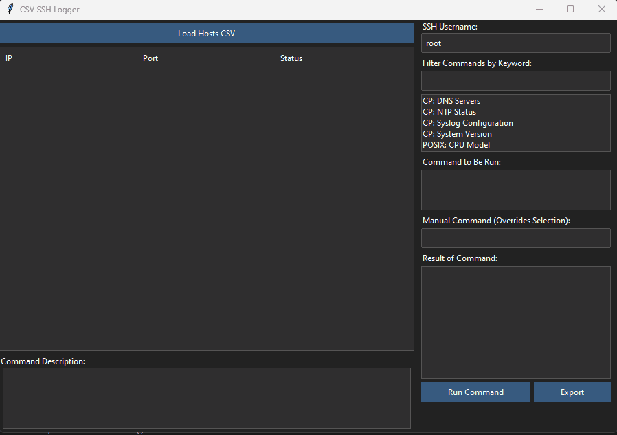

# SSH Looper, 1 Shot Command, Reports

A threaded Python Tkinter GUI tool to SSH into multiple hosts from a CSV file, run a selected command, parse its output, and save all results to an XLSX file.

Built with `ttkbootstrap` (Darkly theme), `paramiko`, and `openpyxl`. Designed for Windows (Python 3.13+).


# Demo



---

## Features

- Load a CSV with `hostname`, `ip`, and `port` fields
- Prompt for masked `username` and `password`
- Filtered command listbox populated by external JSON files in /config directory
- Live preview of selected command and parsing rule
- Thread count is configurable via config.py (default: 5)
- Treeview is updated with "complete" or "error: ..." 
- Outputs XLSX file matching the CSV order
- Errors and parse failures are logged per-host
- Optional DEBUG mode with `colorama` console output

---

## File Structre

```
csv_host_logger/
├── main.py                   # Entry point: GUI + app logic, creates and manages thread pool.  
|                             # Use Queue and check queue with .after()
├── ssh_worker.py             # Threaded SSH execution logic
|                             # each function handles one host, runs ssh logic and puts result into the result queue
├── file_handler.py           # CSV/JSON/XLSX loading & saving after all threads finish, thread safe logging
├── config/
│   └── commands_disk.json    # JSON with command + parse rules (can have multiple files)
├── assets/
│   └── example_hosts.csv     # Sample CSV for testing
├── output/
│   └── results_TIMESTAMP.xlsx  # Auto-saved output files
├── logs/
│   └── TIMESTAMP.log         # All threads for a particular run belong in a single timestampe file of when it was run
├── README.md                 # Project overview (what you already have)
├── requirements.txt          # Dependencies list
├── config.py                 # MAX_THREADS, DEBUG, TIMEOUT, etc
```


## Input File Formats

### 1. CSV Hosts File

Required columns: `hostname`, `ip`, `port`

Error checking is run on the csv before runtime and will state the row and error type.

```csv
hostname,ip,port
Server28,192.168.7.28,22
Server29,192.168.7.29,22
Server30,192.168.7.30,22
```

> Only the `ip` and `port` are used for connections. `hostname` is for user reference.

---

### 2. Commands JSON File

There will be different json files for each command.    The script will read the directory, validate all json then load them.   Typically these commands are single shot, one per file.

** Commands are Extensible ** - just add more commands and test them if it's something you will do frequently.  Note that json requires specific formatting and special characters to be escaped.


#### uptime example

uptime.json

```json
{
    "Check Uptime": {
      "command": "uptime",
      "parse": "load average: (.+)",
      "description": "show the uptime command..."
    }
}
```

#### df example

df.json

```json
{
  "Disk Free": {
    "command": "df -h /",
    "parse": "/dev/\\S+\\s+\\S+\\s+\\S+\\s+\\S+\\s+(\\S+)",
    "description": "Shows percent free.   Should always be at least 20 percent"
  }
}
```

- `command`: what will be executed via SSH
- `parse`: regex used to extract desired result from output


### 3. Manual COmmands

Tested with chained and piped commands such as file creation and modification:

```
echo 'test_sshlooper_write_check' | tee -a /tmp/sshlooper_testfile && tail /tmp/sshlooper_testfile
echo 'test_sshlooper_write_check2' | tee -a /tmp/sshlooper_testfile && tail /tmp/sshlooper_testfile
```

The test above did not clobber a file, and worked as expected.    Use EXTREME caution when running commands.   Test them first in a non destructive way before blasting them out!

** Note on 1 Shot ** Your command must be written as 1 shot.  YOU cannot use any response prompt in parameko library.    This means you cannot use a sudo prompt without making the sudoers file passwordless for that user.

---

## Config file

Central config file has max threads, timeout, debug and other common shared info

## Output

Results are saved as an `.xlsx` file:
- File auto-opens after completion
- Each row matches an input host
- Columns: `hostname`, `ip`, `port`, `timestamp`, `output`, `error` (if any)
- Errors (e.g., timeout, auth failure, parse issues) are included inline
- auto creates if not exist
---

## Installation Suggestion

Use a venv

### Windows

```
git clone git@github.com:rubysash/sshloop.git
cd sshloop
python -m venv sshloop
cd sshloop
scripts\activate
python -m pip install --upgrade pip
python -m pip install -r requirements.txt
```

### Linux

```
git clone git@github.com:rubysash/sshloop.git
cd sshloop
python3 -m venv sshloop
cd sshloop
source bin/activate
python3 -m pip install --upgrade pip
python3 -m pip install -r requirements.txt
```


## How to Use

1. Run the script:  
   `python main.py`

2. Browse and load:
   - A `.csv` list of hosts
   - A `.json` list of commands

3. Enter your `username` and `password`  
   (Password field is masked)

4. Select a command from the dropdown  
   View the full command and parsing rule in the preview area

5. Start the process  
   Progress bar shows completion status

6. Upon finish:
   - XLSX file is written
   - It opens automatically
   - Errors are shown and logged (if DEBUG is enabled)

---

## Debug Mode

Enable `DEBUG = True` in the script to:
- See detailed connection logs
- Output color-coded status to console via `colorama`

---

## Customization

- Change max threads or default timeout in the script settings
- Add or modify command definitions in the `commands.json` file
- You can add regex-based parsing per command to tailor output data

---

## Example Use Case

- Audit uptime or disk usage across a fleet of Linux servers
- Capture standard data across an enterprise in real time
- Generate XLSX summaries for IT reporting

---

## Tested Environments

- Windows 10/11
- Python 3.10+
- Target machines: SSH-enabled Linux hosts


## Notes on Threading

- Tkinter is not thread-safe. Never update the UI (like progress bars or labels) directly from a thread.
- Instead, use after() or a polling loop in the main thread to update the GUI from a shared queue or data buffer.
- Each thread should wrap the SSH execution in a try/except, and return both success and error info for logging.
- Create a thread pool or cap active threads to 5–10 at once. Too many simultaneous SSH connections can cause instability or timeout issues.
- Use concurrent.futures.ThreadPoolExecutor or threading.Semaphore.


## Error Handling
- centralized logger function is called with red/green/blue/white error codes for colorama if debugging, and plain text to the saved log.
- Dedicated logfile captures base error and timestamp, including host info.
- Passwords are not stored in logs


## Parsing
 - goal is to parse single or multiple line responses

## Todo

- implement the logging functionality
- add csv error checking and validation
- add colorama outputs in debugging
- verify &&, | and other manual commands

